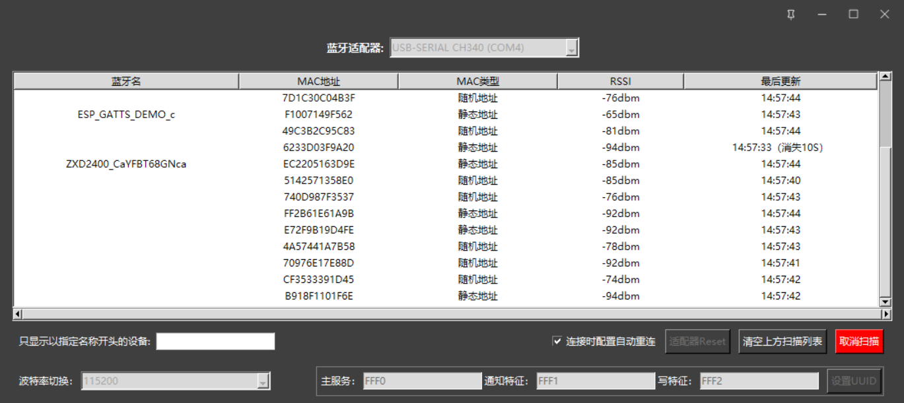
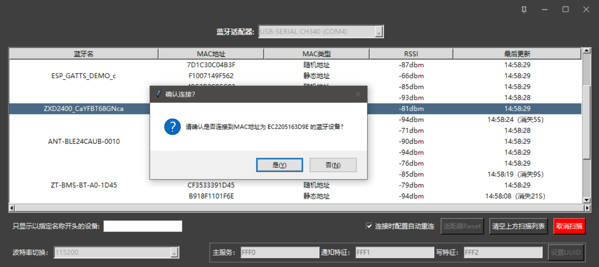

# 关于此GUI

单纯是新一官方没有出一个很好用的主机模式下的配置GUI，浪费了模块的主机功能，很多时候某些产品的QC测试需要蓝牙主机的参与，
比如说搜索一下看看产品的蓝牙有没有正常广播以此验证蓝牙是否正常可用，甚至于连上去进行通信
> 连接功能只能配置主服务和TX和RX特征，基本够用，但是没有更大扩展性

# 支持的模块型号

* XY-MBA32A

# 支持的平台

理论上是支持tkinter和pyserial所能支持的平台的，比如MACOS，LINUX，但是我画GUI的时候，自己改了改GUI的WINDOW外框，这就导致依赖了WIN32的GUI，所以目前只能支持WINDOWS，
如果说你想支持其他的平台的话，你得再改改代码，把`BorderlessWindow`和`TitleBarSimple`屏蔽掉

# 通用接口封装

通信接口封装模块：`bleuart.py`，此模块不依赖GUI，可独立使用。

虽然本质上我是为了做一个GUI而封装了一个通信接口实现，但是实际上这个接口也可以拿来干其他活儿，比如说集成到你的QC_GUI里去做你自己的逻辑

# Pyinstaller打包GUI为单个exe

* cd 到工程根目录
* 执行 `pyinstaller -F -w gui_ble_to_uart.py --add-data "widget_img/*.png;widget_img"`

# 免责声明

本人只是购买与使用了新一的模块，不代表新一官方，且本人跟新一官方无任何商业上的合作，不负责新一官方任何的技术型售前售后，不为新一官方做任何的责任承担，请悉知！
如果你不同意我的观点，则请勿使用和分发此源代码与软件本身，否则你将为你的行为而负责，而非本仓库作者。

附新一的淘宝店地址：https://shop354605177.taobao.com/

# 必不可少的截图

